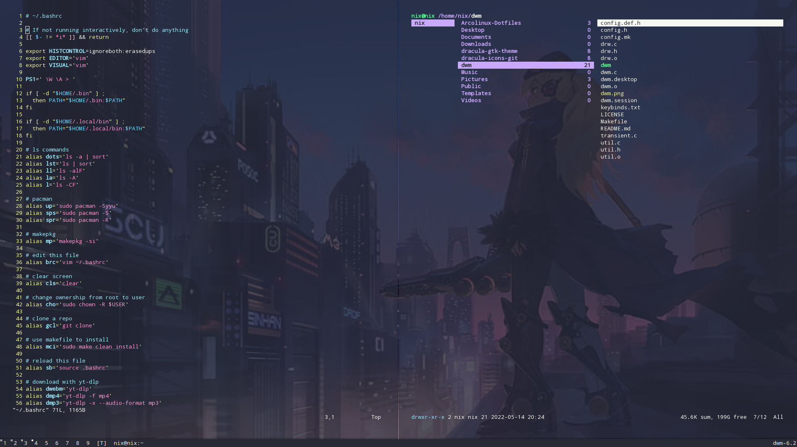

# Minimal-DWM-Build

A very minimal [dwm](https://dwm.suckless.org/) set up to build from source.



## By the way, I use Arch

To install the dependencies in Arch-based distros, enter the following

```
sudo pacman -S libx11 libxft libxinerama lxappearance dmenu termite firefox nitrogen picom
```

## Cheat sheet

The default keybinds are listed in 'keybinds.txt'.

## Build process if you ALREADY have the xfce4 desktop environment installed on your system

1. Clone or download this repo and cd into the folder.
2. Set permissions on 'dwm.desktop', 'dwm-session' and 'Makefile' to allow execution using either the command line or the right-click menu in your graphical file manager.
3. Enter the command

```
sudo chown -R $USER /usr/share/xsessions/
```

4. Copy the 'dwm.desktop' file to

```
/usr/share/xessions/ 
```

with the command line or the right-click menu in your graphical file manager.

5. Log in as the root user with the 'su' command, then copy the 'dwm-session' file to

```
/usr/local/bin/ 
```

6. As the normal user, build dwm with this command

```
sudo make clean install
```

7. Add picom and termite configs, such as the ones in my [Arcolinux-Dotfiles](https://github.com/sammi-turner/Arcolinux-Dotfiles) repo.
8. Log out of your session. When you log back in, select 'DWM session' rather than 'Xfce Session'.
9. On your first log in, the bar will appear, but the log in screen will still be visible. Open dmenu, type 'nitrogen' into the search bar, and press enter. Use the Nitrogen GUI to select your default wallpaper for future logins.

## Change themes and icons with lxappearance

The default gtk and icon themes are ugly, but they can easily be changed. Type 'lxappearance' into dmenu and press enter to launch a graphical tool designed to change them.

## Keybinds

I have hard-coded my default keybinds in 'config.h'. The 'config.def.h' file is just a copy of those default settings.

## Changing your config.h

To change the default keybinds, change the 'config.h' file, recompile dwm, log out, and then log back in.
